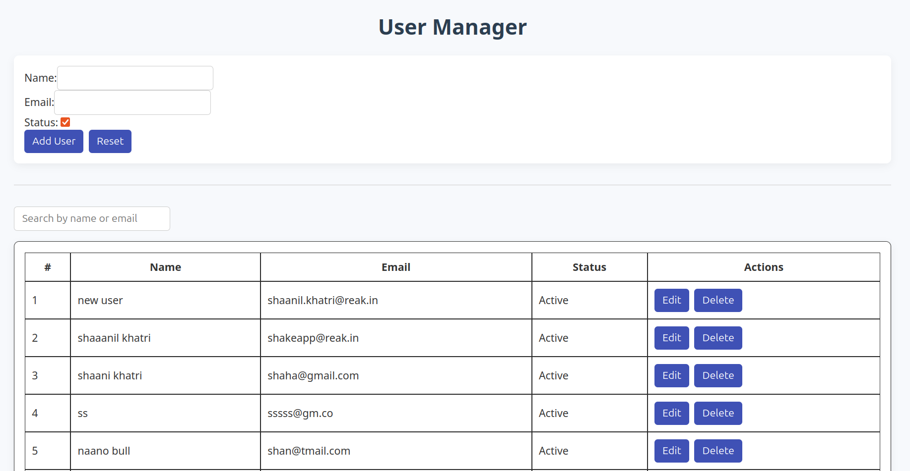
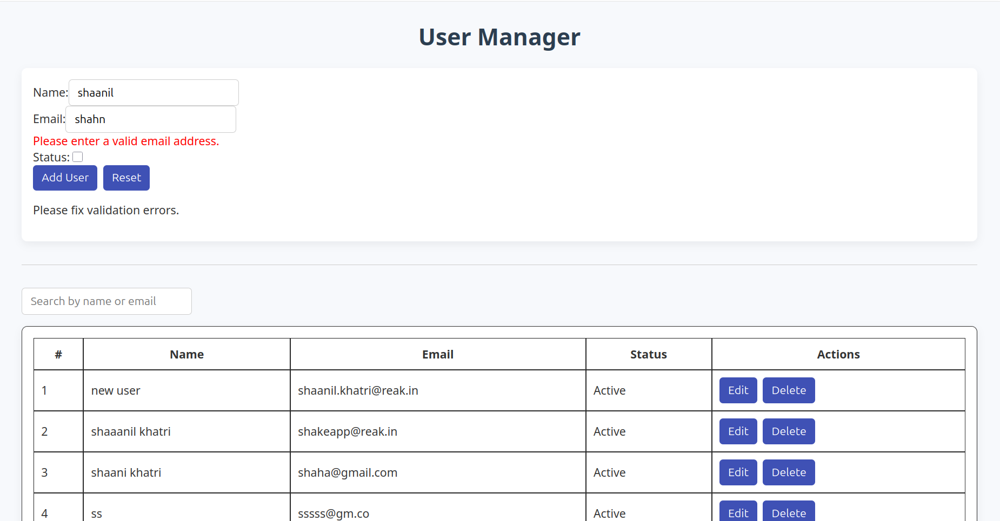

## User Manager App

A full-stack CRUD application built with **Angular (frontend)** and **Node.js + Express + Sequelize + SQLite (backend)**.

This app allows you to:
- Add new users
- Edit existing users
- View users in a table
- Search users by name or email (with debounced input)
- Validate inputs using patterns for name and email

## tech Stack

 Layer     | Tech Used                              
-----------|----------------------------------------
 Frontend  | Angular, ngModel, CSS            
 Backend   | Node.js, Express, Sequelize ORM        
 Database  | SQLite (in-memory or file-based)       

##  How to Run It on your system

### Prerequisites

- Node.js 
- Angular CLI (if you want to serve manually)
- npm or yarn

### Run the backend

```bash
    cd backend/
    npm i
    npm start
```
The backend will start on: http://localhost:3000

### Run the frontend

```bash
    cd user-manager-frontend
    npm i
    ng serve
```
The Angular frontend will be available at: http://localhost:4200


## Screenshots



